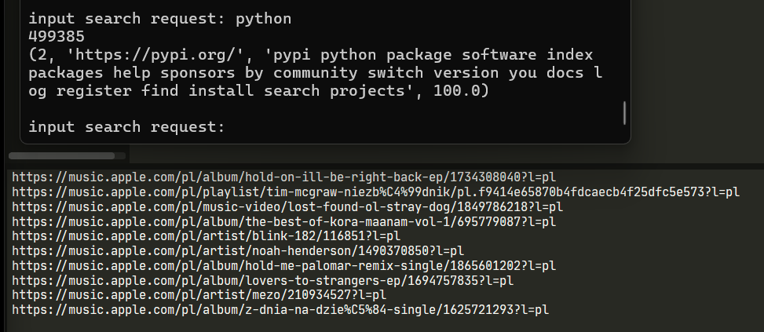

# Завдання
Використати BeautifulSoup для парсингу сторінки зі списком елементів, витягнути текст, почистити від зайвих пробілів та HTML-символів і порахувати топ-20 найчастіших слів.

# Опис
Дане завдання мені захотілось виконати в контексті пошукових систем. Оскільки їхній принцип досить схожий, а саме те, що в бд для індексації вони зберігають якусь інформацію про сторінку, в нашому випадку - це топ 20 найчастіших слів. Для швидкості роботи будемо використовувати бібліотеки для роботи з асинхронними запитами до серверів та бд.  
Пошукові системи складаються з трьох частин: краулер - мережевий паук, який ходить по сторінкам, знаходить посилання на інші ресурси і додає до загальної черги, далі відбувається індексація бд, тобто обробляються сторінки і додається інформація про сторінку до бд, потім ранжування - сортування результатів за пошуковим запитом. 
Отже в мене є два файли: crawler.py, search.py. У першом реалізовується краулер і додавання інформації до бд, в другому - пошук в бд за пошуковим запитом.  

## crawler.py
Тут використовуються наступні бібліотеки: bs4 для обробки сторінок за допомогою BeautifulSoup, який парсить сторінку (наприклад з використанням lxml, html5lib, html.parser, тощо) і зберігає її у вигляді дерева тегів, які можна певним чином обробити. Asyncio, aiohttp - для асинхронної роботи, re - для очистки і фільтрації тексту за допомогою регулярних виразів, random - тільки для того, щоб перетасувати посилання. mysql і функція connect з mysql.connector.aio, оскільки, знову ж таки, використовується asyncio і звичайні бібліотеки не підходять, оскільки вони блокують головний потік і eventloop буде просто чекати і не зможе передати керування іншим корутинам. Counter з бібліотеки collections - тільки тому, що у нього є метод most_common(), який підрахує бажану кількість кожного елемента в списку. 
Основний клас Crawler з одним тільки публічним методом  crawl(). У конструкторі ініціалізуємо основні змінні. seed_urls - до черги додаються наперед задані посилання, щоб краулер міг з чогось почати, далі headers - це потрібно для запитів до серверів, async_workers - кількість асинхронних воркерів, які будуть робити запити до серверів, max_pages - максимальна кількість оброблених сторінок, досягнувши якої, програма завершується, add_link - кількість сторінок, які краулер додасть до черги, обробивши сторінки, якщо такі є. 
__connect_db() - встановлює з'єднання з бд. 
У методі crawl() ініціалізуємо воркерів і запускаємо їх. join() блокує основний потік, поки черга не буде пустою. 
__worker() - працює у нескінченном циклі, робить запит, отримує сторінку, обробляє її, додає до черги інші посилання, додає запис про сторінку до черги бд. 
__db_worker() - додає запис до бд на основі спецаільної черги для бд. 
__update_links() - допоміжна функція, в якій реалізовується додавання посилань до черги 
__filter_page() - метод класу, який обробить сторінку, почистить від зайвих символів та пробілів.

## search.py
Використовуються бібліотеки: mysql.connector - для встановлення з'єднання з бд (тут вже без асинхронної роботи), webbrowser - просто щоб відкрити посилання у браузері, rapidfuzz - для нечіткого порівняння рядків та слів. 
Є клас SearchEngine, в конструкторі тільки sql-запит до бд для отримання всіх сторінок. 
__connect_db() - встановлює з'єднання з бд. 
search() - виконує запит до бд, отримує усі сторінки, проходиться по ним і знаходить найкращий результат за допомогою функції token_set_ratio(), яка порівнює слова в двох рядках.

## Результат

Зверху результат пошуку, знизу - результат роботи краулера
