## Завдання

4. Визначення змін у русі транспорту під час поворотів. Потрібно виявити різкі зміни кута нахилу транспортного засобу під час поворотів і побудувати графік змін кута нахилу, що допоможе оцінити стабільність руху під час маневрів. Обробка даних включає обчислення кутових змін і визначення точок різких коливань.

## Мета

Кожен транспортний засіб має критичний кут нахилу, після якого він втрачає зчеплення з дорогою або перекидається. Тут буде розглянуто спробу знайти такі критичні кути нахилу для велосипеда. В теорії це може знадобитись для роботизованих велосипедів, які будуть доставляти їжу, посилки тощо, а також як приклад для аналогічних експериментів з мотоциклами, електросамокатами та іншими видами транспорту.

## Експеримент

Було обрано застосунок phyphox (перший зі списку, запропонований у роботі), оскільки інші, такі як sensors kinetics (рисунок 1) чи arduino science journal (рисунок 2) не надавали значень орієнтації. 

    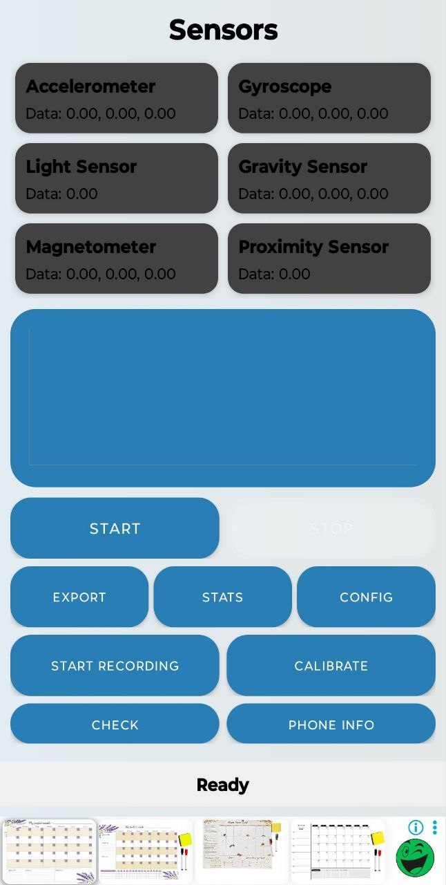

    Рисунок 1 - Sensors kinetics

 

    

    Рисунок 2 - Arduino science journal

 

Для збору даних мені треба було жорстко закріпити телефон. Для цього спочатку хотів закріпити підставку для телефону за допомогою дерев'яного бруска, обв'язаного навколо центральної частини рулевої рами (рисунок 3), але, зрозумівши, що це хибна ідея, зробив інакше - з використанням металевої перфорованої пластини (рисунки 4, 5).

    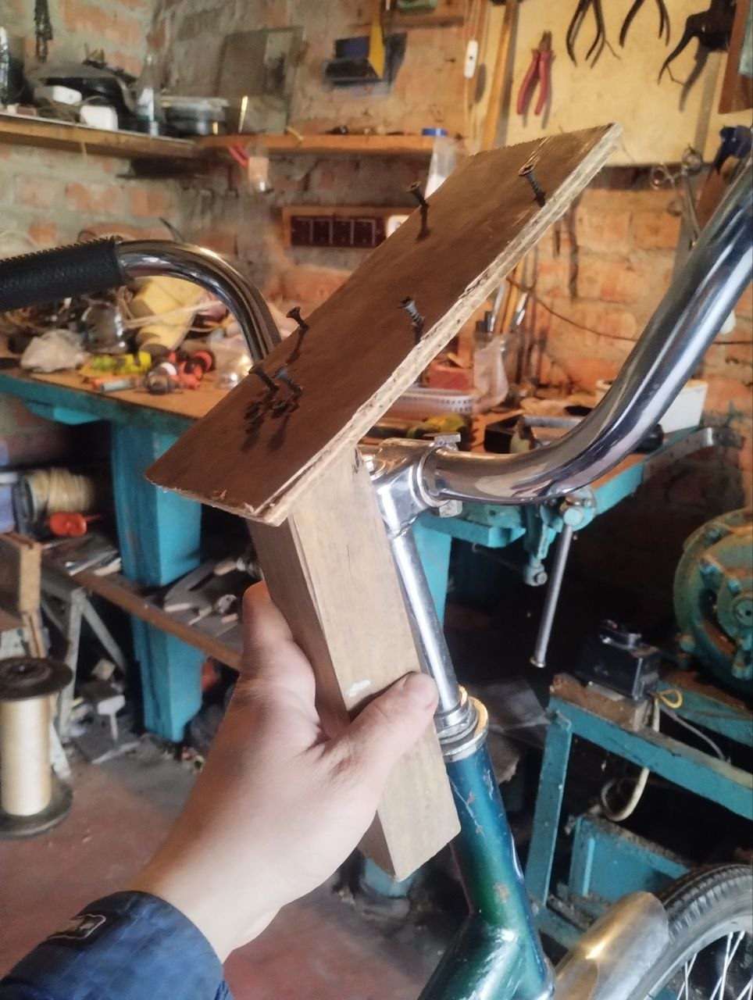

    Рисунок 3 - Невдала версія кріплення підставки для телефону

 

    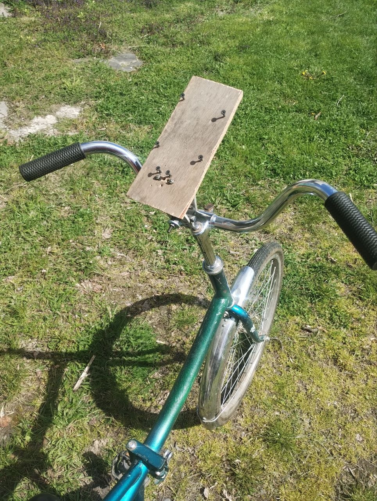

    Рисунок 4 - Кріплення підставки для телефону (один вигляд)

 

    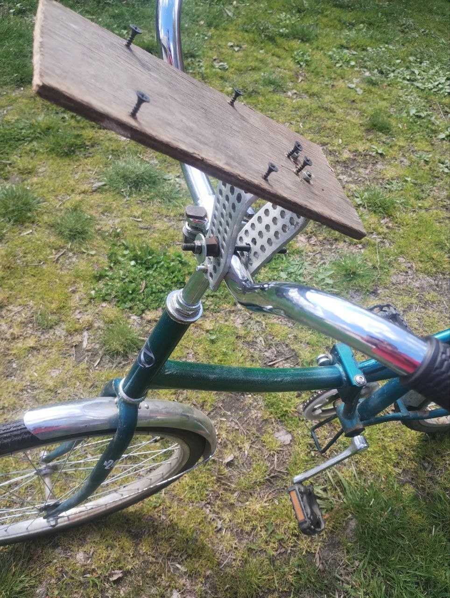

    Рисунок 5 - Кріплення підставки для телефону (другий вигляд)

 

Після декількох експериментів було прийнято рішення змінити положення підставки таким чином, щоб зручніше було зрозуміти положення осей (рисунки 6, 7).

    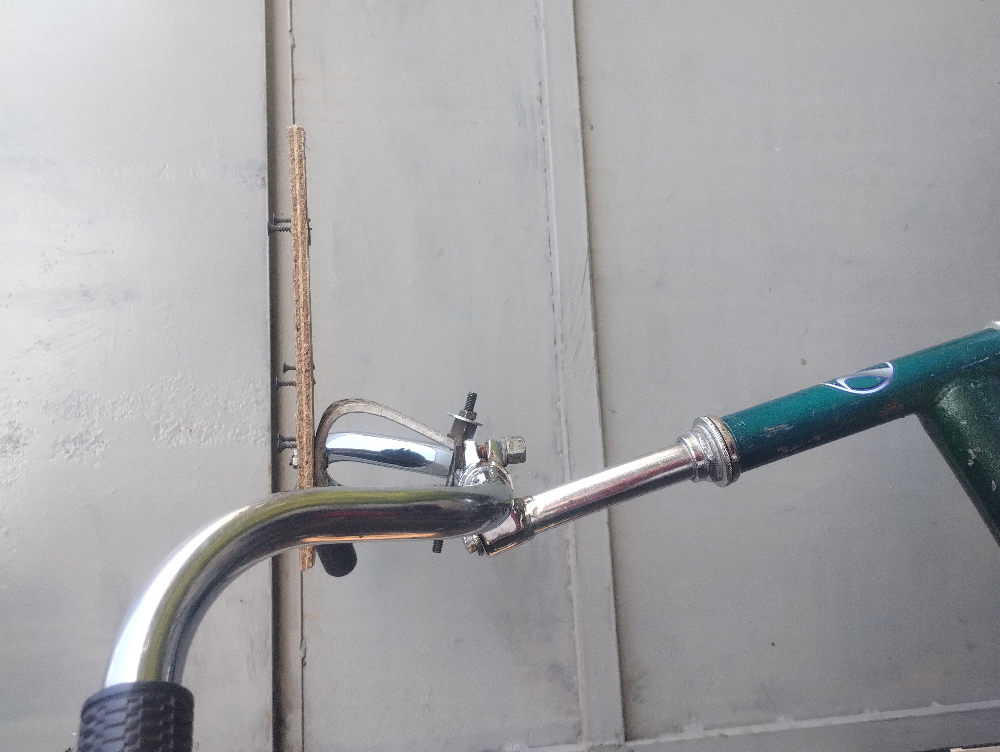

    Рисунок 6 - Виправлене положення кріплення підставки для телефону (один вигляд)

 

    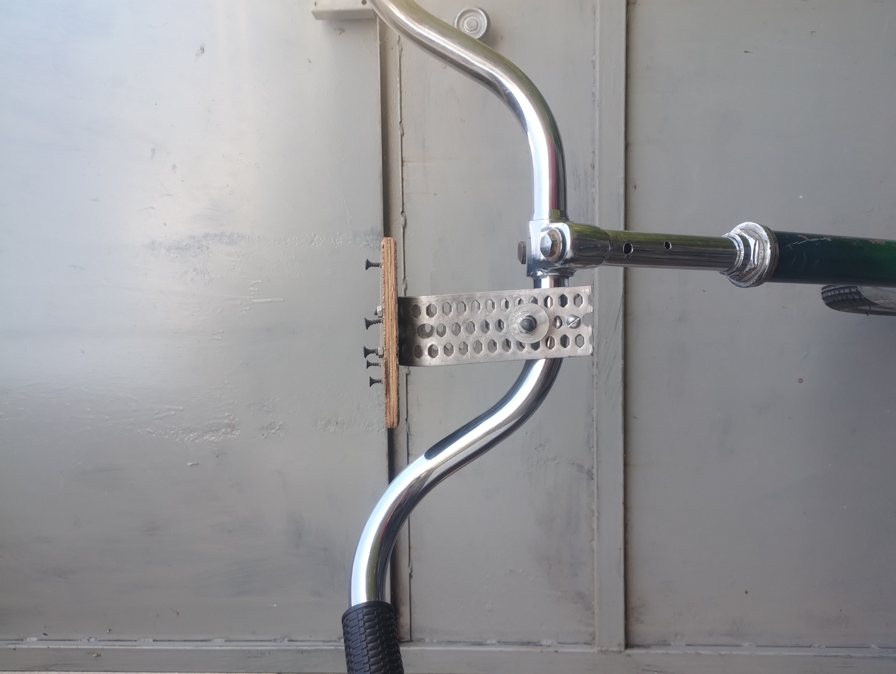

    Рисунок 7 - Виправлене положення кріплення підставки для телефону (другий вигляд)

 

У застосунку були усі необхідні датчики для визначення, а саме: акселерометер - для визначення прискорення тіла по усім координатним осям, гіроскоп - для визначення кутової швидкості тіла по усім координатним осям, і, найважливіше, значення орієнтації згідно <a href="https://www.iso.org/obp/ui/en/#iso:std:iso:8855:ed-2:v1:en">ISO8855:2011(en)</a> - для визначення кутів нахилу (крен (roll, вісь x), тангаж (pitch, вісь y), рискання (yaw, вісь z)) (рисунки 8, 9, 10), при чому орієнтація не вимірюється окремим фізичним датчиком, а обчислюється на оснві даних акселерометра та гіроскопа за допомогою алгоритмів sensor fusion, який включає об'єднання даних та мінімазацію випадкового відхилення (шуму).  

    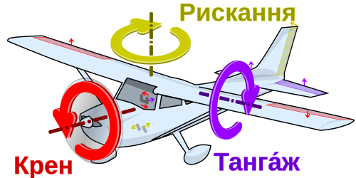

    Рисунок 8 - Орієнтація літака

 

    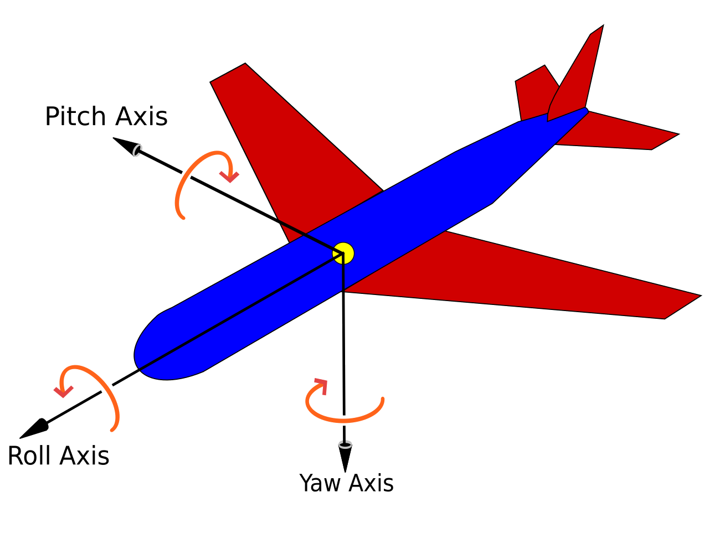

    Рисунок 9 - Орієнтація літака (англ. термінологія)

 

    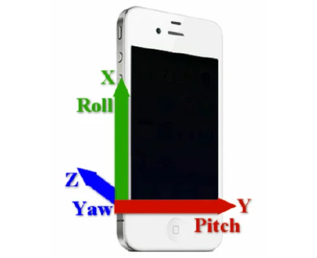

    Рисунок 10 - Орієнтація телефона

 

    На цьому моменті у мене виникла плутанина, оскільки були переплутані осі (GIF1, GIF2, GIF3).

 

    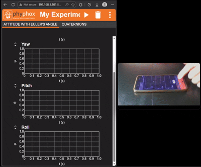

    GIF 1 - Орієнтація телефона у застосунку phyphox

 

    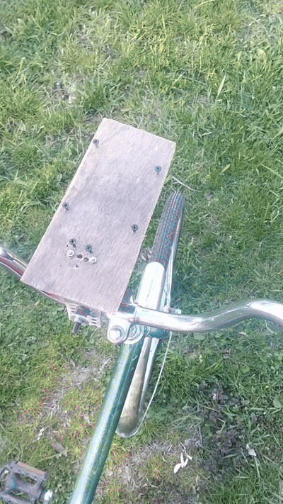

    GIF 2 - Значення яке мало б вимірюватись як roll (крен), вимірюється як pitch

 

    

    GIF 3 - Значення яке мало б вимірюватись як yaw (рискання), вимірюється як roll

 

    Тут треба просто змиритись з цим і аналізувати подальші графіки саме з pitch - тепер це наш основний показник, на основі якого будемо виявляти різкі зміни кута нахилу транспортного засобу під час поворотів. На офіційному сайті phyphox стосовно <a href="https://phyphox.org/wiki/index.php/Attitude_sensor">орієнтації</a> немає точної інформації про цю проблему, хоча згадується <a href="https://uk.wikipedia.org/wiki/%D0%91%D0%BB%D0%BE%D0%BA%D1%83%D0%B2%D0%B0%D0%BD%D0%BD%D1%8F_%D0%BE%D0%B1%D0%B5%D1%80%D1%82%D0%B0%D0%BD%D0%BD%D1%8F">gimbal lock (блокування обертання)</a> (GIF 4) - втрата одного ступеню свободи в тривимірному, потрійному механізмі карданного підвісу, яка відбувається коли осі двох із трьох кілець підвісу знаходяться паралельно, чим призводять до того, що система може обертатися лише у виродженому двовимірному просторі. 

 

    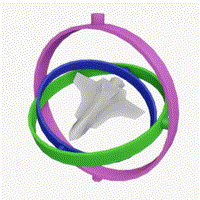

    GIF 4 - Gimbal lock (блокування обертання)

 

Це може бути поясненням для різких стрибків з 180° до -180° на графіку roll (рисунок 16) при поворотах на 180°.

Також варто згадати магнітометр, який використовується для визначення кута рискання, однак для аналізу нахилу транспортного засобу його роль є другорядною.  
Далі в самому застосунку окрім вибору датчиків, мені пропонують виставити значення чутливості (рисунок 11). Опираючись на статтю <a href = "https://www.researchgate.net/publication/390123448_Influence_of_Sampling_Rate_on_Wearable_IMU_Orientation_Estimation_Accuracy_for_Human_Movement_Analysis">Influence of Sampling Rate on Wearable IMU Orientation Estimation Accuracy for Human Movement Analysis</a>, вибираю 100 Hz (100 замірів в секунду), що забезпечить достатню фіксацію динамічних змін руху. В ході експериментів це рішення було змінено на 0 - в застосунку вказано, що в такому випадку будуть братись значення з максимальною частотою. Це було необхідно, оскільки в іншому випадку чомусь застосунок глючив і не видавав ніяких даних, лініяк графіку не малювалась. В результаті експериментів було виявлено, що це ніяким чином не вплинуло на результати.

    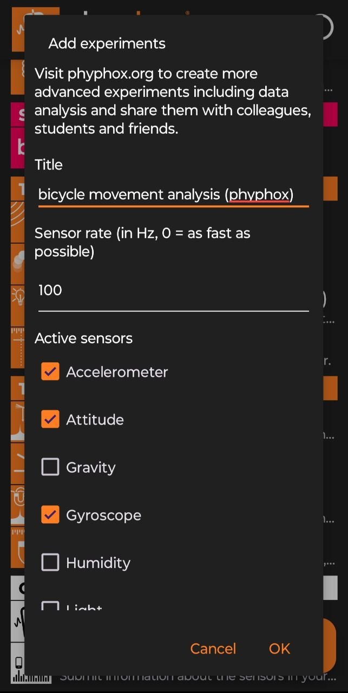

    Рисунок 11 - Чутливість датчиків

 

Експеримент проводився на рівній твердій поверхні наступним чином: спочатку плавний поворот на 90°, потім різкий поворот (під різким мається на увазі такий поворот, при якому відчувається сильна нестабільність і втрата зцеплення коліс з поверхнею, тобто додати ще декілька градусів >5° і відбудеться падіння) на ту ж величину, потім все теж саме, тільки при повороті на 180° і в кінці прямий проїзд без поворотів. В застосунку можна було ставити процес збору даних з сенсорів на паузу і продовжити в будь-який інший зручний момент, чим я і скористався, щоб після виконання повороту повернутися в початкове місце і повторити експеримент. При цьому кожний раз треба було зануляти значення орієнтації (рисунок 12), для того, щоб перейти від абсолютної орієнтації до відносної при початку руху. Тобто таким чином ми зможемо коректно порівнювати результати різних маневрів, оскільки усі вони починаються з однакового кута - 0°.

    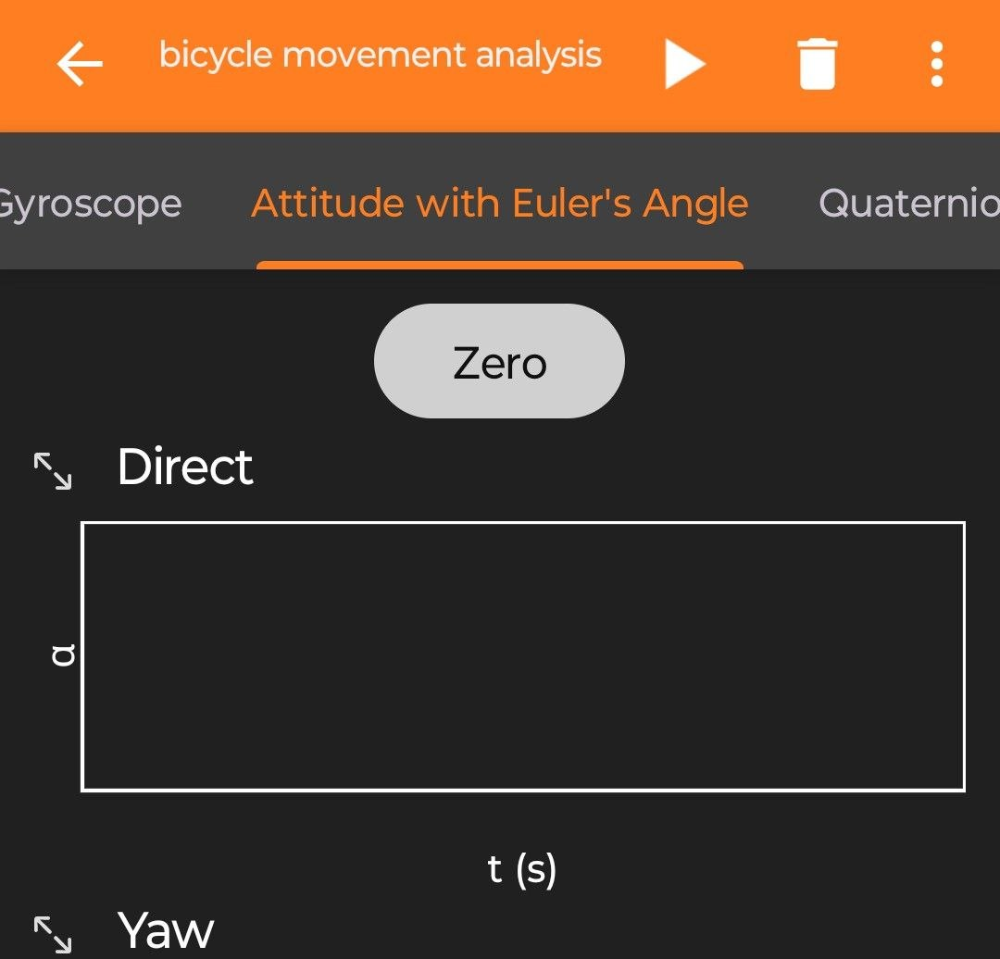

    Рисунок 12 - Занулення кутів

 

Після цього можна завантажити зібрані дані (рисунок 13).

    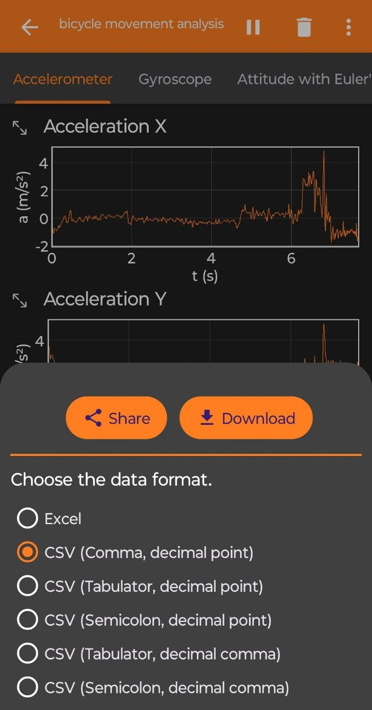

    Рисунок 13 - Експортування даних у форматі CSV

 

Тепер можна у зручному вигляді відобразати усі ці дані за допомогою python та класичних, для такого типу задач, бібліотек: pandas, matplotlib, numpy (рисунки 14, 15, 16). Код знаходиться у smartphone_sensor.py.

    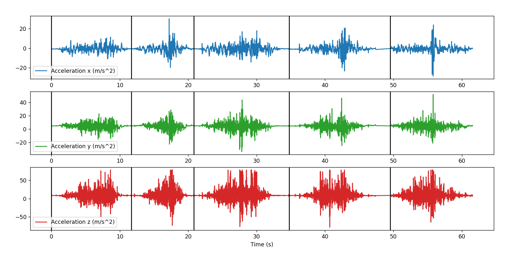

    Рисунок 14 - Графік даних з акселерометра (експеримент 1)

 

    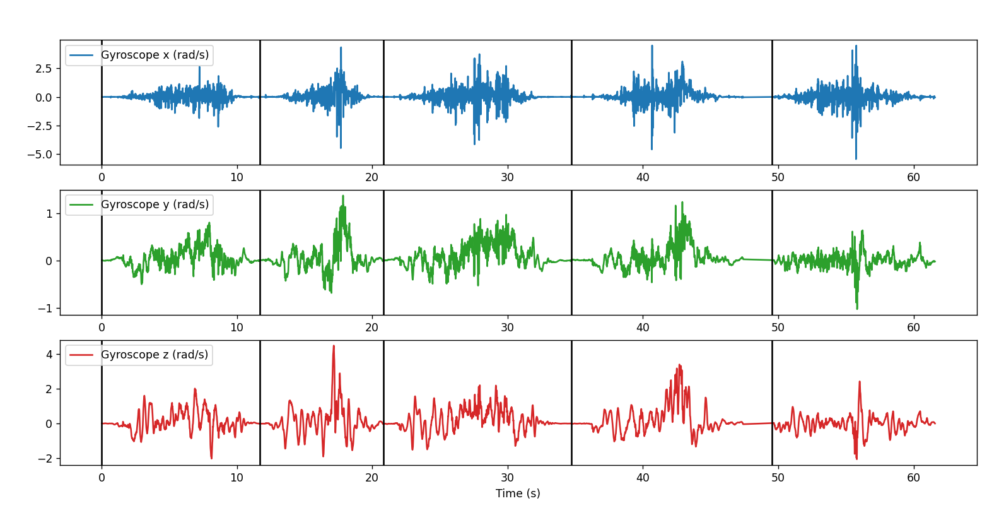

    Рисунок 15 - Графік даних з гіросокпа (експеримент 1)

 

    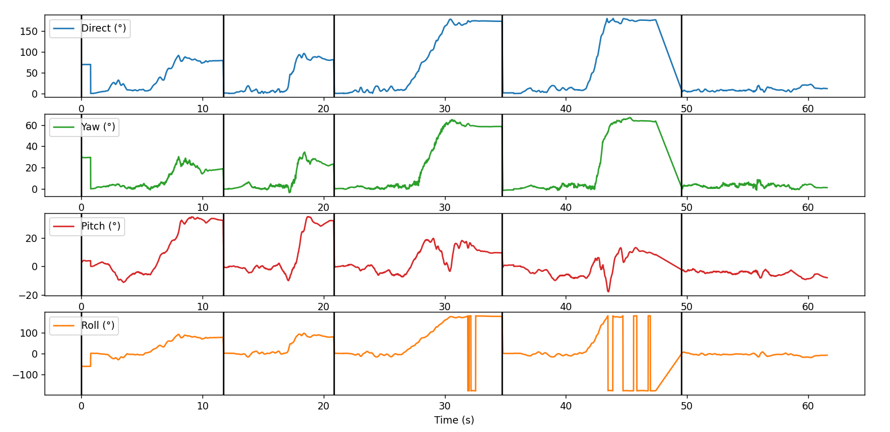

    Рисунок 16 - Графік даних орієнтації (експеримент 1)

 

Тепер проведемо другий експеримент (проводиться після встановлення того, що основним є значення орієнтації pitch в застосунку phyphox для виявлення зміни нахилу велосипеда) (рисунок 17). 

    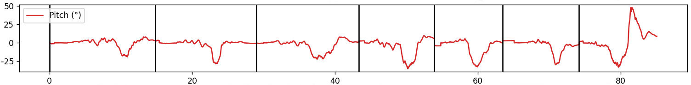

    Рисунок 17 - Графік даних орієнтації (експеримент 2, графік - pitch, тангаж)

 

Знову ж таки, теоретично це мало б бути значення крена (roll), тобто і там, і там знаходимо кут навколо осі x, але в застосунку він називається pitch (тангаж).  
Тут були проведені ті ж повороти у тій же послідовності з тією ж швидкістю (приблизно), але окрім цього в кінці замість прямого проїзду було зроблено три різких повороти на 90° з різною швидкістю (~10 км/год, ~20 км/год, ~30 км/год) з похибкою в 5 км/год - це зроблено для виявлення кореляції між кутом нахилу та швидкістю при повороті, яка точно буде, оскільки зв'язок пов'язаний фізично формулою віражу, зображеної на рисунку 18.

    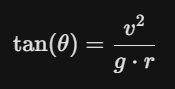

    Рисунок 18 - Формула кута нахилу

Віраж — це крутий поворот або криволінійний рух літака, автомобіля чи велосипедиста, що супроводжується нахилом транспортного засобу для компенсації відцентрової сили. Тобто швидкість напряму впливає на кут нахилу велосипеда до поверхні. З цієї формули видно, що чим більша швидкість, тим більшим буде кут нахилу. Також цікавий момент в тому, що з формули видно, що маса транспортного засобу не впливає на результат.

 

## Аналіз та обробка даних

Графіки першого експерименту (акселерометра і гіроскопа) наведені тільки для візульного розуміння (рисунки 14, 15), видно, що дані досить шумні, оскільки навіть останній прямий проїзд за прискоренням і кутовою швидкістю на перший погляд не відрізнити від тих, де були повороти. Тепер проаналізуємо дані і виявимо різкі зміни кута нахилу транспортного засобу під час поворотів і визначимо точки різких коливань. Для цього підходять графіки орієнтації першого та другого експериментів. Дані орієнтації першого графіку (рисунок 16) при прямому проїзді кажуть нам, що датчики працюють вірно, оскільки кути майже не змінюються. Тепер проведемо аналіз значень орієнтації для другого експерименту, оскільки там окрім самих поворотів є дані, отримані при різних швидкостях (нас цікавить саме значення pitch). Для цього помітимо, що на рисунку 17 різкі зміни кута нахилу характеризуються провалинами вниз (ями), хоча, якщо повертати в іншу сторону, то, відповідно, це були б "гори". Також помічаємо, що значення усіх цих кутів приблизно знаходяться навколо 25°, при чому останній стрибок вверх ми не будемо враховувати, оскільки це був поворот в зворотну сторону, зроблений поза експериментом. Таким чином ми можемо знайти конкретні значення різких коливань (критичних кутів нахилу) на кожному проміжку, і, в якості підсумкового значення, - максимальне по модулю усіх значень (рисунок 19).

    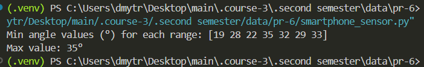

    Рисунок 19 - Точки різких коливань

 

## Висновки

Отже для велосипеда на швидкості 5-35 км/год при здійснені поворотів на рівній твердій поверхні критичним кутом нахилу є 35°. 

    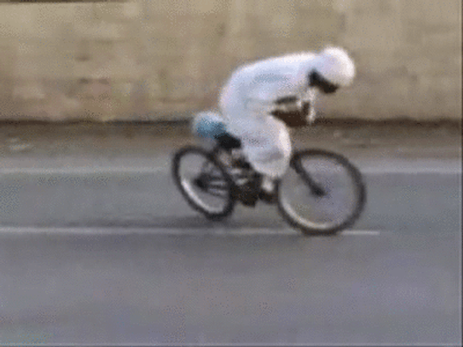

